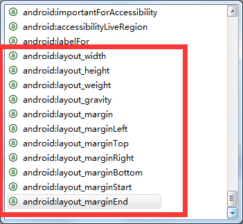

###布局参数
Android组件中属性的命名是有规则的, 许多以`layout_`开头, 比如`android:layout_marginLeft`; 另外一些不是以`layout_`开头的比如`android:text`.

以`layout_`开头的作用于该组件的父组件, 用于告诉父组件如何安排子组件的属性. 而不以`layout_`开头的表示组件本身的属性. 在Eclipse中我们可以看到有如下`layout_`开头的属性:

