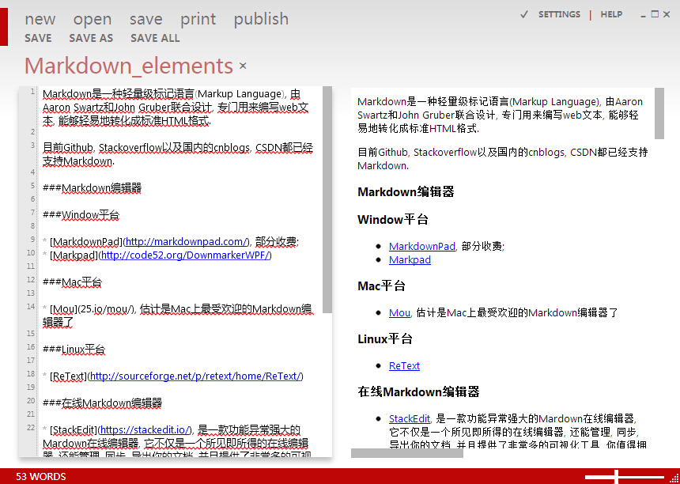
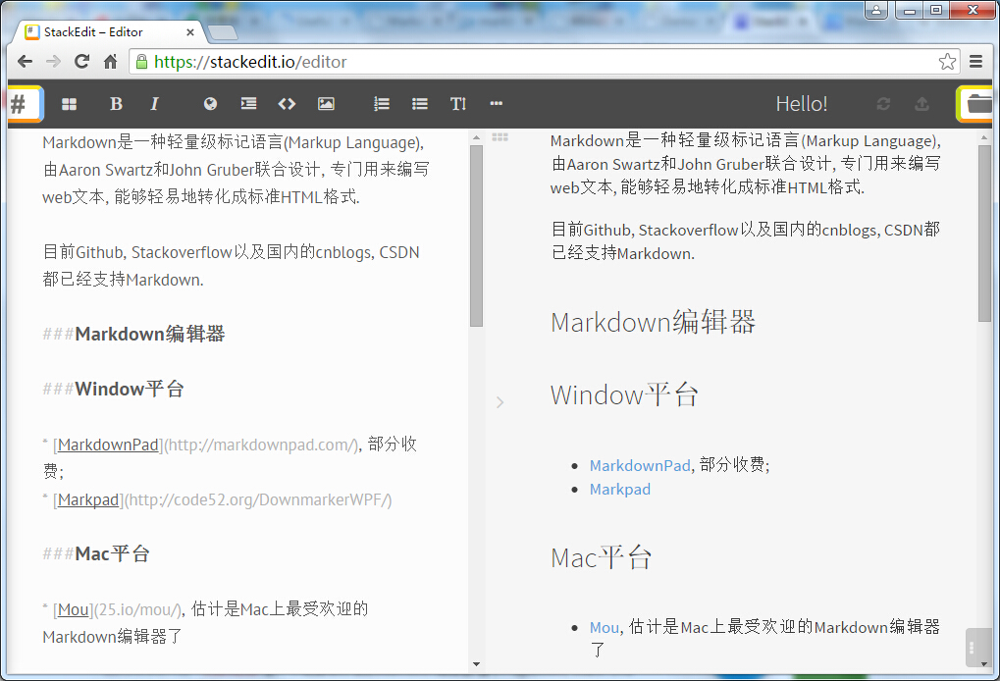
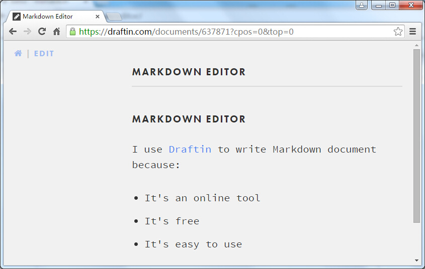
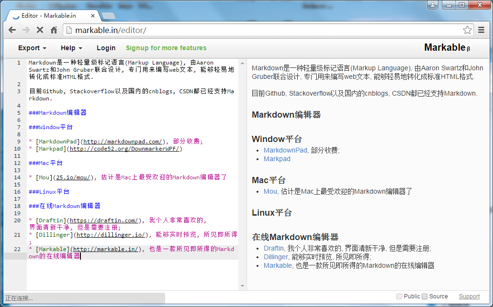
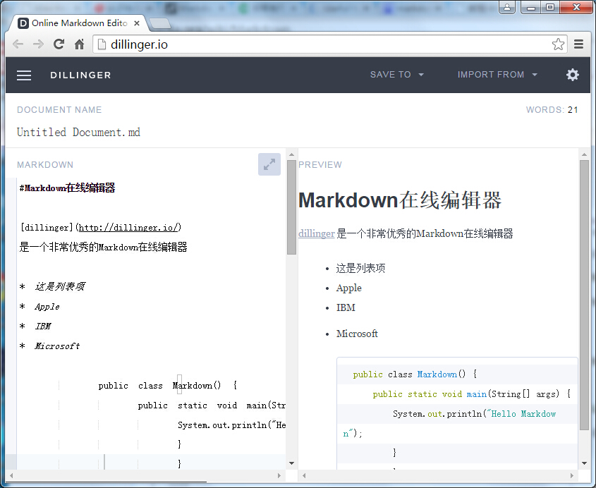

Markdown是一种轻量级标记语言(Markup Language), 由Aaron Swartz和John Gruber联合设计, 专门用来编写web文本, 能够轻易地转化成标准HTML格式. 

目前Github, Stackoverflow以及国内的cnblogs, CSDN都已经支持Markdown.

###Markdown编辑器

###Window平台

* [MarkdownPad](http://markdownpad.com/), 部分收费;
* [Markpad](http://code52.org/DownmarkerWPF/)

###Mac平台

* [Mou](25.io/mou/), 估计是Mac上最受欢迎的Markdown编辑器了

###Linux平台

* [ReText](http://sourceforge.net/p/retext/home/ReText/)

###在线Markdown编辑器

* [StackEdit](https://stackedit.io/), 是一款功能异常强大的Mardown在线编辑器, 它不仅是一个所见即所得的在线编辑器, 还能管理, 同步, 导出你的文档, 并且提供了非常多的可视化工具, 你值得拥有.

* [Draftin](https://draftin.com/), 我个人非常喜欢的, 界面清新干净, 但是需要注册;

* [Markable](http://markable.in/), 一款所见即所得的Markdown的在线编辑器

* [Dillinger](http://dillinger.io/), 也是能够实时预览, 所见即所得;

###Markdown工具箱

* [markitup](http://markitup.jaysalvat.com/home/)