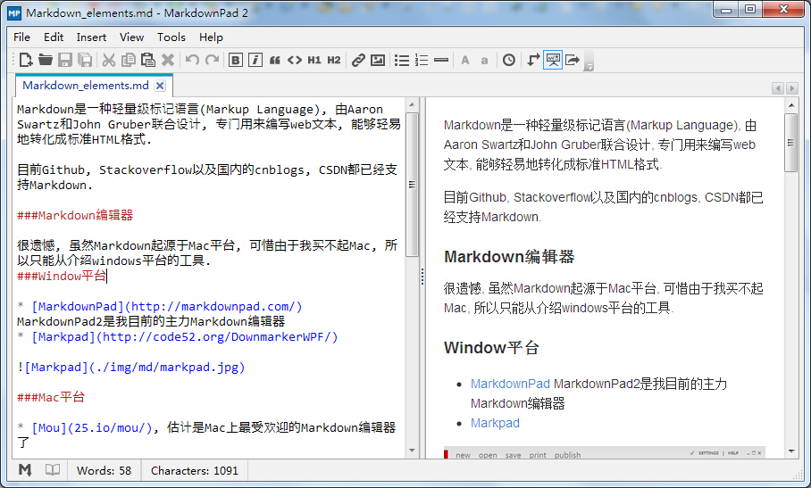

#Markdown编辑器
Markdown是一种轻量级标记语言(Markup Language), 由Aaron Swartz([悼念](http://www.rememberaaronsw.com/memories/))和John Gruber联合设计, 专门用来编写web文本, 能够轻易地转化成标准HTML格式. 

目前Github, Stackoverflow以及国内的cnblogs, CSDN都已经支持Markdown.

Markdown的详细语法可以参见:

* [Markdown snytax 英文版](http://daringfireball.net/projects/markdown/syntax)
* [Markdown语法 中文版](https://github.com/ayningcao/ayningcao.github.io/blob/master/Markdown_syntax.md)

##Markdown桌面编辑器

很遗憾, 虽然Markdown起源于Mac平台, 可惜由于我买不起Mac, 所以只能从介绍windows平台的工具.

#####Window平台

* [MarkdownPad](http://markdownpad.com/)
MarkdownPad2是我目前的主力Markdown编辑器, 分为免费版和Pro版(15刀), 提供Markdown代码高亮, 实时预览等功能

* [Markpad](http://code52.org/DownmarkerWPF/)

Markpad是windows下另外一个非常优秀的编辑器, 提供了足够强大的功能, 并且她还是Metro风格的UI.

#####Mac平台

* [Mou](25.io/mou/), 估计是Mac上最受欢迎的Markdown编辑器了, 没用过, 不做评价.

#####Linux平台

* [ReText](http://sourceforge.net/p/retext/home/ReText/)

##在线Markdown编辑器

如果你不想安装编辑器, 那么你也可以使用Markdown在线编辑器, 功能同样非常强大, 而且选择面很多. 除了Github, stackoverflow等平台的编辑器, 你也可以使用独立的在线编辑器.

* [StackEdit](https://stackedit.io/), 是一款功能异常强大的Mardown在线编辑器, 它不仅是一个所见即所得的在线编辑器, 还能管理, 同步, 导出你的文档, 并且提供了非常多的可视化工具, 你值得拥有.

* [Draftin](https://draftin.com/), 我个人非常喜欢的, 界面清新干净, 但是需要注册;

* [Markable](http://markable.in/), 一款所见即所得的Markdown的在线编辑器

* [Dillinger](http://dillinger.io/), 也是能够实时预览, 所见即所得;

在这个[markdown-editors-and-tools](http://codegeekz.com/markdown-editors-and-tools/)网站中坐着罗列了非常多的Markdown工具大家可以参考, 我一一试用了这些编辑器和工具, 把其中一些使用体验不是很好的就没在这里介绍了, 能够掌握其中一两种编辑器或者工具就已经足够用了.

###Markdown开发者工具

如果你是一名开发者, 或者希望搭建自己的Markdown在线编辑器, 

* [markitup](http://markitup.jaysalvat.com/home/): 一个可定制化的所见即所得文本编辑器.

* [showdownjs](https://github.com/showdownjs/showdown): 著名的markdown-HTML解析器

* [markdown-js](https://github.com/evilstreak/markdown-js/): Markdown解析器的Javascript实现版本, 能够将Markdown文本转换为HTML代码

* [MarkdownJ](http://sourceforge.net/projects/markdownj/): Markdown解析器的Java实现版本